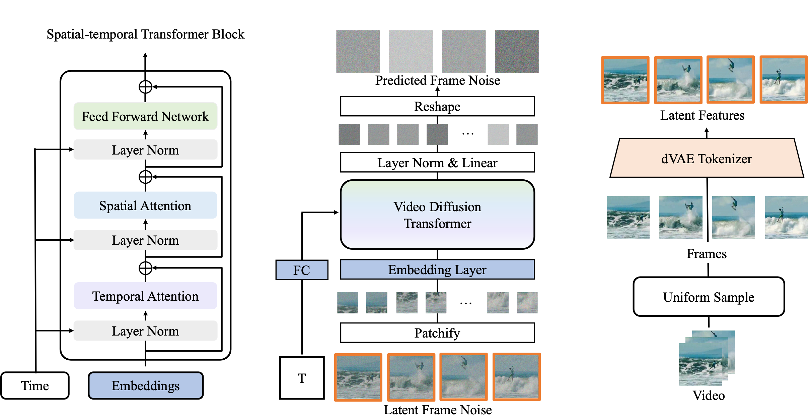
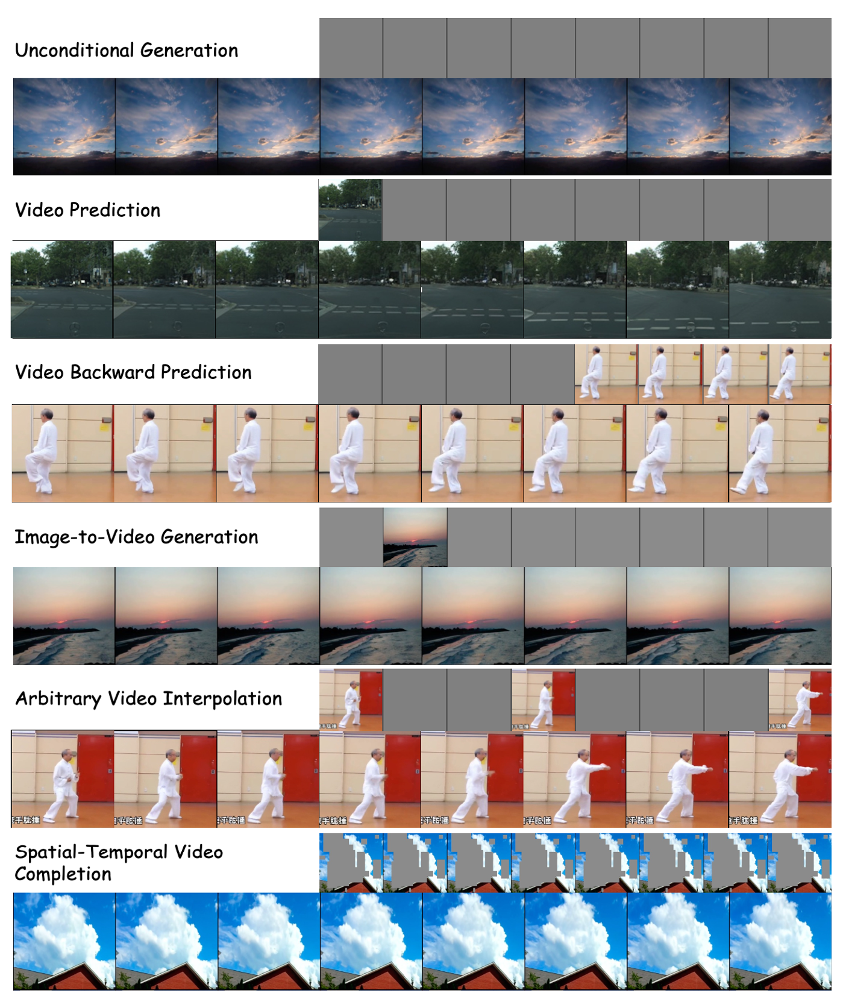

# VDT
[ICLR2024] The official implementation of paper "VDT: General-purpose Video Diffusion Transformers via Mask Modeling", by Haoyu Lu, Guoxing Yang, Nanyi Fei, Yuqi Huo, Zhiwu Lu, Ping Luo, Mingyu Ding.

## Introduction
This work introduces Video Diffusion Transformer (VDT), which pioneers the use of transformers in diffusion-based video generation.
It features transformer blocks with modularized temporal and spatial attention modules, allowing separate optimization of each component and leveraging the rich spatial-temporal representation inherited from transformers.

VDT offers several appealing benefits.
(1) It excels at capturing temporal dependencies to produce temporally consistent video frames and even simulate the dynamics of 3D objects over time.
(2) It enables flexible conditioning information through simple concatenation in the token space, effectively unifying video generation and prediction tasks.
(3) Its modularized design facilitates a spatial-temporal decoupled training strategy, leading to improved efficiency. 

Extensive experiments on video generation, prediction, and dynamics modeling (i.e., physics-based QA) tasks have been conducted to demonstrate the effectiveness of VDT in various scenarios, including autonomous driving, human action, and physics-based simulation.

## Release

✅ <b>2024-05-05</b>: Release spatial-temporal mask modeling code and inference code.

✅ <b>2024-01-27</b>: Our VDT has been accepted by ICLR2024.

✅ <b>2023-05-22</b>: We propose Video Diffusion Transformer (VDT) model and release checkpoint and inference code. 

## Getting Started

- Python3, PyTorch>=1.8.0, torchvision>=0.7.0 are required for the current codebase.
- To install the other dependencies, run
<pre/>conda env create -f environment.yml</pre> 
<pre/>conda activate VDT</pre> 

## Checkpoint
We now provide checkpoint for Sky Time-Lapse unified generation. You can download it from <a href="https://drive.google.com/file/d/1WIAOm4n0HkmOHMhUj3y6wLLemtz_Xj8b/view?usp=sharing">here</a>.

## Inference
We provide inference ipynb on Sky Time-Lapse unified generation (predict, backward, unconditional, single-frame, arbitrary interpolation, spatial_temporal). To sample results, you can first download the checkpoint, then run inference.ipynb, have fun!

## Acknowledgement
Our codebase is built based on DiT, BEiT, SlotFormer and MVCD. We thank the authors for the nicely organized code!
